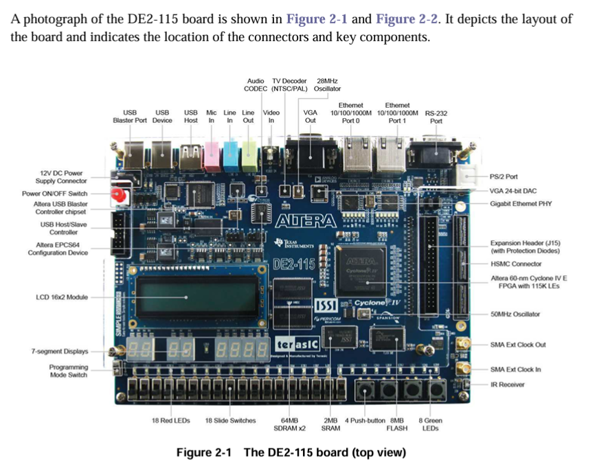
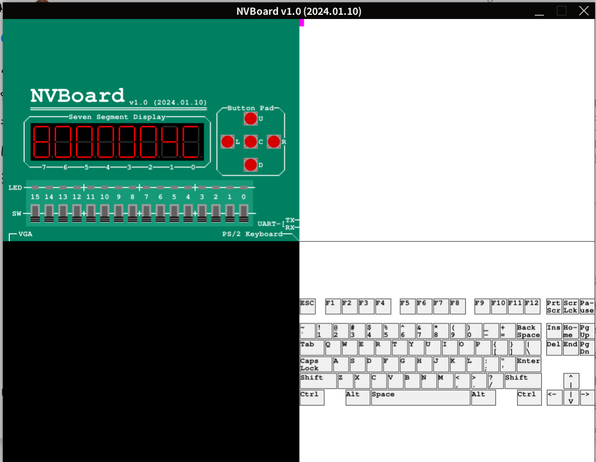

# riscv64i: A 64 bit RISC-V Processor
## Overview
`riscv64i` is a 64-bit RISC-V processor core running on FPGA. The processor evolves a multi-stage pipeline (to be specific, 8-stage) and single issue per cycle.
## Pipeline
### stages
- `IF1`: fetch and buffer instructions getting from `RAM`
- `IF2`: choose instructions passed by `IF1` and acting CF predictions
- `ID`: decode instrctions and asycn accessing `register file`
- `EX`: calculate and check CF predictions
- `MEM1`: access `RAM` to read or write
- `MEM2`: receive sync reading results from `RAM` and apply bit extractions
- `MEM3`: this stage is mainly designed to shorten critical path, meanwhile it works as a multiplexer to select writing back data between memory read data and `ALU` calculating result.
- `WB`: write back results to `register file`
### forwards
Currently, the pipeline includes 7 types of forwarding. The definition can be found in `pipeline_pkg.sv`. 
Notice that `MEM2_TO_ALU` will only forward ALU calculating result even though memory reading is actually finished. Delaying the data forwarding to `MEM3` is conducive to timing closure.
### flush
In stage `EX`, the processor will check the Validity of control-flow prediction. If wrong, the frontend of the pipeline will be clear.
### stall
Stalling is designed for data hazard. To be brief, if a `Load` instrution is in one of the stage among `MEM1`, `MEM2` and `MEM3`, the hazarding instrution has to stall for a few cycles.
### control flow 
`riscv64i` don't have a specific predictor now, it will assume any branch / jump instructions as none-taken.
## 3rd-party
- `abstract-machine`: to provide riscv64i bare machine compiling and linking after slightly modifying. [site: abstract-machine](https://nju-projectn.github.io/ics-pa-gitbook/ics2025/2.3.html "")
- `am-kernels`: to provide cpu testcases. [site: am-kernels](https://nju-projectn.github.io/ics-pa-gitbook/ics2025/2.2.html "")
- `nemu`: reuse the `sdb` part and combine it with verilator simulation C++ files to create a single step debugger. [site: nemu](https://nju-projectn.github.io/ics-pa-gitbook/ics2025/1.3.html "")
## Software
### Verilator
Employ `Verilator` for RTL compilation and C++ simulation source and header file generation.
### NVBoard
Use `NVBoard` as virtual FPGA to test display logic.[site: nvboard](https://github.com/NJU-ProjectN/nvboard "")
### Quartus Prime Lite
Provide FPGA on-borad programmer and IP core generator.
### sv2v
Convert SystemVerilog to Verilog HDL. [site: sv2v](https://github.com/zachjs/sv2v "")
## Runtime
### NVBorad or CLI
#### Makefile Cmd
- `make nvrun`:<br> running simulation on nvboard.
- `make run`: <br> running simulation on CLI.
- `make debug`: <br> running simulation on CLI and activate debugger.
- `make ARCH=riscv64-npc ALL=<testcase-name> testcase`:<br> this will compile testcase, and generate `<testcase-name>-riscv64-npc.elf` `<testcase-name>-riscv64-npc.bin` `<testcase-name>-riscv64-npc.txt`, `app.bin` and `app.hex`. <br> `testcase` option can be replace by `nvrun` `run` or `debug`
### FPGA
#### Machine

#### Makefile Cmd
- `make sv2v`:<br> converting SystemVerilog to Verilog HDL
- `make cp`:<br> running `make sv2v` then copy HDLs to `$(CP_DIR)`
#### IP Core
- On Chip Memory - RAM: 2-PORT<br>
  The `RAM` (inside `vsrc/resource/MemControl.sv`) rtl for simulate is not ideal to synthesis.<br>
  configure can be found as `FPGA/resource/RAM.v`, and the initial file is `app.mif`.
- PLL - ALTPLL<br>
  configure can be found as `FPGA/resource/PLL.v`, but basically the fequency remain 50MHZ as DE2-115 default. 

## Example
### dummy app
```asm
./build/dummy-riscv64-npc.elf：     文件格式 elf64-littleriscv


Disassembly of section .text:

0000000080000000 <_start>:
    80000000:	00000413          	li	s0,0
    80000004:	00009117          	auipc	sp,0x9
    80000008:	ffc10113          	addi	sp,sp,-4 # 80009000 <_end>
    8000000c:	02c000ef          	jal	80000038 <_trm_init>

0000000080000010 <main>:
    80000010:	ff010113          	addi	sp,sp,-16
    80000014:	00113423          	sd	ra,8(sp)
    80000018:	00813023          	sd	s0,0(sp)
    8000001c:	01010413          	addi	s0,sp,16
    80000020:	00000793          	li	a5,0
    80000024:	00078513          	mv	a0,a5
    80000028:	00813083          	ld	ra,8(sp)
    8000002c:	00013403          	ld	s0,0(sp)
    80000030:	01010113          	addi	sp,sp,16
    80000034:	00008067          	ret

0000000080000038 <_trm_init>:
    80000038:	ff010113          	addi	sp,sp,-16
    8000003c:	00000517          	auipc	a0,0x0
    80000040:	01450513          	addi	a0,a0,20 # 80000050 <_etext>
    80000044:	00113423          	sd	ra,8(sp)
    80000048:	fc9ff0ef          	jal	80000010 <main>
    8000004c:	0000006f          	j	8000004c <_trm_init+0x14>

```
If processor works well, the last committed inst will stay at `0x8000004c`.
### On NVBoard

### On FPGA
